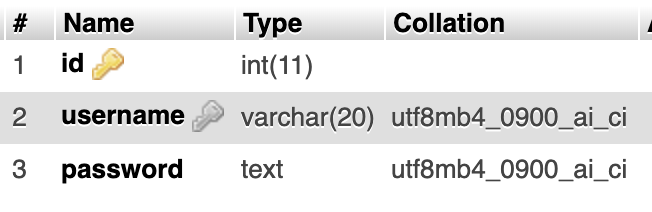

# The-Locator
A website that allows users to get the address of any place they are looking for.

The website uses Google Maps APIs and was made to test my skills in utilizing public APIs, creating a login page and using bootstrap


## Demo


## Running locally

### 1. Database setup

You should have am up and running local mysql database with the following details

	username = "root"
	password = "root"
	dbname   = "demo"


You should have one simple table named `users`, structured as the following
 


### 2. Installation & Development

Clone the repository
```shell
git clone https://github.com/ialmoqren/The-Locator
```

Navigate to the project directory
```shell
cd The-Locator
```

You serve the php project the way you like, but for a quick test run
```shell
php -S localhost:8080
```

Then open the link [http://localhost:8080](http://localhost:8080)
